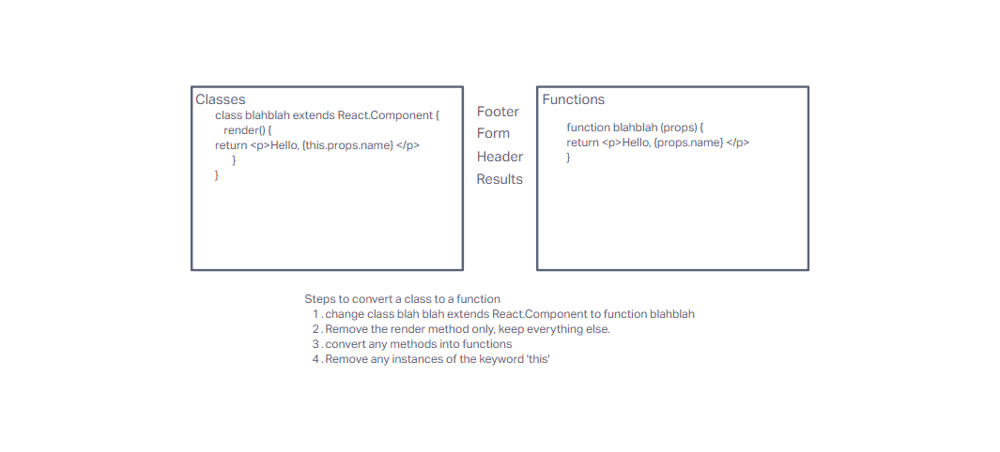

# RESTY

## Starting Point (Lab 26)

* Convert all Child Components into Functions, and maintain full functionality.

[Attribution](https://tech.shaadi.com/2022/07/21/how-to-convert-class-components-to-function-components-in-react/)